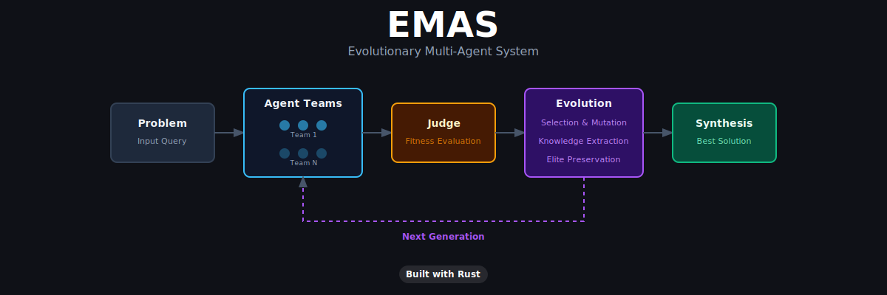

# EMAS - Evolutionary Multi-Agent System

<p align="center">
  
</p>

**Deterministic Orchestration of Non-Deterministic Agents.**

EMAS treats AI agents like biological organisms. Instead of one prompt -> one
answer, it spins up *teams* of agents with different reasoning strategies and
evolves the best approach through natural selection.

Built in **Rust** for zero-cost concurrency, high-speed evaluation, and
memory-safe agent lifecycle management.

### Showcase

<p align="center">
  <video src="https://github.com/FrogSnot/EMAS/raw/master/Showcase.mp4" width="100%" controls></video>
</p>

---

### Components

| Module         | Role |
|----------------|------|
| **Genotype**   | Agent DNA: system prompt, reasoning strategy, temperature |
| **Agent**      | A single AI worker. Calls the LLM with its genotype's config |
| **Team**       | A group of agents (standard + 1 Red-Team) tackling a problem |
| **Orchestrator** | The Judge. Scores teams on Quality, Consistency, Efficiency |
| **Knowledge**  | Global Knowledge Base: persists insights & conflicts across generations |
| **Evolution**  | Selection, crossover, and mutation operators |
| **Arena**      | The environment. Runs the full evolutionary loop |
| **TUI**        | Terminal User Interface for interactive queries and monitoring |
| **LLM Client** | Async HTTP client - supports OpenAI-compatible & Google Gemini natively |

### Reasoning Strategies

Each team member is assigned one of nine reasoning strategies:

- **Chain-of-Thought** - Step-by-step decomposition
- **Critical Analysis** - Scrutinise flaws and assumptions
- **Creative / Lateral** - Unconventional, cross-domain thinking
- **Strict Logic** - Formal deductive / inductive reasoning
- **Edge-Case Analysis** - Boundary conditions and failure modes
- **Performance Focus** - Optimisation and benchmarking
- **Devil's Advocate** - Argue against the obvious solution
- **First Principles** - Rebuild from fundamental truths
- **Red-Team Analyst** - Active contrarian; searches for alternative solutions

> **Note:** Every team of size > 1 automatically includes exactly one **Red-Team Analyst** to ensure healthy divergence and prevent groupthink.

### Fitness Function

| Metric        | Description | Default Weight |
|---------------|-------------|:--------------:|
| **Quality**   | Dual-Judge evaluation (Correctness, Skeptical, or Exhaustive) | 0.50 |
| **Consistency** | Pairwise Jaccard similarity (with bonus for Red-Team divergence) | 0.30 |
| **Efficiency** | Inverse token usage (decays quadratically over generations) | 0.20 |

#### Advanced Scoring Dynamics

1.  **Dual-Judge Rotation**: The Orchestrator rotates between three judge personas (Correctness, Skeptical, Exhaustiveness) to prevent agents from "gaming" a single evaluator.
2.  **Efficiency Decay**: In early generations, efficiency is weighted heavily to find cheap, fast solutions. As evolution progresses, the weight decays, allowing the system to prioritise raw depth and quality over cost.
3.  **Red-Team Divergence Bonus**: While standard agents are rewarded for agreement, the Red-Team worker is rewarded for *diverging* from the consensus, earning the team bonus points for surfacing novel alternatives.
4.  **Diversity Penalty**: Teams that repeat a conclusion that previously scored poorly receive a fitness penalty, pushing the population toward unexplored areas of the solution space.
5.  **Global Knowledge Base**: Insights and conflicts discovered in prior generations are injected into the system prompts of subsequent agents, allowing the system to "remember" and resolve past disagreements.

### Evolutionary Operators

1. **Selection**: Top 40% of teams survive as elites.
2. **Crossover**: Two elite parents produce a child; for each agent slot,
   a genotype is randomly picked from either parent, temperatures are blended.
3. **Mutation** (per-agent, probability = `mutation_rate`):
   - Temperature perturbation +/-0.15
   - 25% chance: strategy swap
   - 20% chance: instruction modifier appended

---

## Quick Start

### Prerequisites

- Rust toolchain (1.75+): https://rustup.rs
- An OpenAI-compatible API key (OpenAI, Ollama, vLLM, etc.)

### Setup

```bash
# Clone & enter the project
cd EMAS

# Copy the env template and fill in your API key
cp .env.example .env
# Edit .env with your API key

# Build (release mode recommended)
cargo build --release
```

### Run

```bash
# Launch the interactive TUI (Recommended for development)
cargo run --release -- --tui

# Basic CLI usage
cargo run --release -- "What is the most efficient sorting algorithm for nearly-sorted data?"

# With custom parameters
cargo run --release -- \
  --population 8 \
  --team-size 4 \
  --generations 15 \
  --threshold 9.0 \
  --mutation-rate 0.4 \
  --model gpt-4o \
  "Design a rate limiter for a distributed API gateway"
```

### Persistent Settings

EMAS automatically saves your parameters (model, weights, provider, etc.) after every successful run. Subsequent runs will use these as defaults unless overridden.

- **Storage Location**: `~/.config/emas/last_params.json` (Linux)
- **Reset**: Pass `--reset-defaults` to clear saved settings and restore built-in defaults.

---

### Using with Google Gemini

```bash
# Option A: Set GOOGLE_API_KEY (auto-detects provider)
export GOOGLE_API_KEY="AIza..."
cargo run --release -- "What is the most efficient sorting algorithm for nearly-sorted data?"

# Option B: Explicit provider flag
cargo run --release -- \
  --provider google \
  --model gemini-2.0-flash-lite \
  "Design a rate limiter for a distributed API gateway"

# Option C: Other Gemini models
cargo run --release -- \
  --provider google \
  --model gemini-2.5-flash-preview-05-20 \
  "Explain the CAP theorem with practical examples"
```

### Using with Ollama (local models)

```bash
# Start Ollama
ollama serve

# Run EMAS against a local model
cargo run --release -- \
  --api-url http://localhost:11434/v1 \
  --model llama3.1 \
  "Explain the CAP theorem with practical examples"
```

### CLI Options

```
Usage: emas [OPTIONS] [PROBLEM]

Arguments:
  [PROBLEM]  The problem or question to solve (required unless --tui is used)

Options:
      --tui                                    Launch interactive TUI mode
      --population <POPULATION>                Number of teams [default: 5]
      --team-size <TEAM_SIZE>                  Agents per team [default: 3]
      --generations <GENERATIONS>              Max generations [default: 10]
      --threshold <THRESHOLD>                  Convergence threshold 1-10 [default: 8.5]
      --mutation-rate <MUTATION_RATE>          Mutation rate 0-1 [default: 0.3]
      --provider <PROVIDER>                    LLM provider: "openai" or "google"
      --model <MODEL>                          LLM model name
      --api-url <API_URL>                      API base URL
      --api-key <API_KEY>                      Directly provide API key
      --max-tokens <MAX_TOKENS>                Max tokens per response [default: 1024]
      --quality-weight <QUALITY_WEIGHT>        Quality fitness weight [default: 0.50]
      --consistency-weight <CONSISTENCY_WEIGHT> Consistency fitness weight [default: 0.30]
      --efficiency-weight <EFFICIENCY_WEIGHT>  Efficiency fitness weight [default: 0.20]
      --judge-model <JUDGE_MODEL>              Separate model for the Orchestrator
      --judge-provider <JUDGE_PROVIDER>        Provider for the judge ("openai" or "google")
      --judge-api-url <JUDGE_API_URL>          API base URL for the judge
      --judge-api-key <JUDGE_API_KEY>          API key for the judge
      --reset-defaults                         Clear saved parameters
      --no-save                                Don't save parameters after this run
  -h, --help                                   Print help
  -V, --version                                Print version
```

### Environment Variables

| Variable | Fallback | Description |
|----------|----------|-------------|
| `EMAS_API_KEY` | `GOOGLE_API_KEY` / `OPENAI_API_KEY` | API key for the LLM provider |
| `EMAS_PROVIDER` | - | Force provider: `openai` or `google` (auto-detected if omitted) |
| `EMAS_API_BASE_URL` | `OPENAI_API_BASE` | Base URL for the API endpoint |
| `EMAS_MODEL` | `GOOGLE_MODEL` / `OPENAI_MODEL` | Default model name |
| `GOOGLE_API_KEY` | - | Google Gemini API key (triggers auto-detection) |
| `GOOGLE_MODEL` | - | Google model override (default: `gemini-2.0-flash-lite`) |
| `EMAS_JUDGE_MODEL` | agent model | Separate model for the judge / Orchestrator |
| `EMAS_JUDGE_API_KEY` | agent key | API key for the judge (if different provider) |
| `EMAS_JUDGE_API_BASE_URL` | agent URL | API endpoint for the judge |
| `RUST_LOG` | `info` | Logging verbosity (`trace`, `debug`, `info`, `warn`, `error`) |

---

## Why Rust?

| Advantage | Explanation |
|-----------|-------------|
| **Zero-Cost Concurrency** | `tokio` async runtime manages all agent/team API calls concurrently with minimal overhead |
| **High-Speed Evaluation** | The Orchestrator's fitness scoring (Jaccard similarity, normalisation) runs at native speed |
| **Memory Safety** | Ownership model guarantees no leaks when teams are "killed" and agents are spawned/cloned across generations |
| **Predictable Performance** | No GC pauses; consistent latency even under heavy concurrent load |

---

## Project Structure

```
src/
|-- main.rs          # CLI entry point
|-- lib.rs           # Module declarations
|-- config.rs        # CLI args + environment -> Config
|-- genotype.rs      # ReasoningStrategy, Genotype, mutation modifiers
|-- agent.rs         # Agent execution (LLM call)
|-- team.rs          # Team of agents, concurrent execution
|-- llm.rs           # OpenAI-compatible HTTP client
|-- orchestrator.rs  # Fitness evaluation (Quality, Consistency, Efficiency)
|-- evolution.rs     # Selection, crossover, mutation, next generation
|-- knowledge.rs     # Persistence of insights & conflicts
|-- arena.rs         # The Arena: full evolutionary loop + display
|-- tui/             # Interactive Terminal UI
```

---

## License


**Polyform Non-Commercial License 1.0.0**